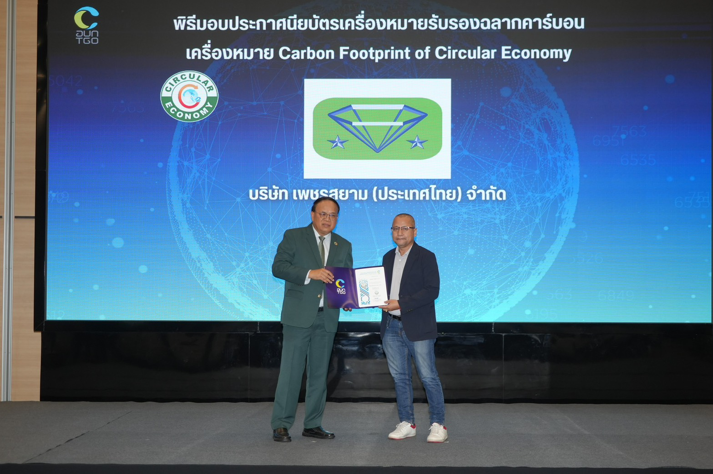
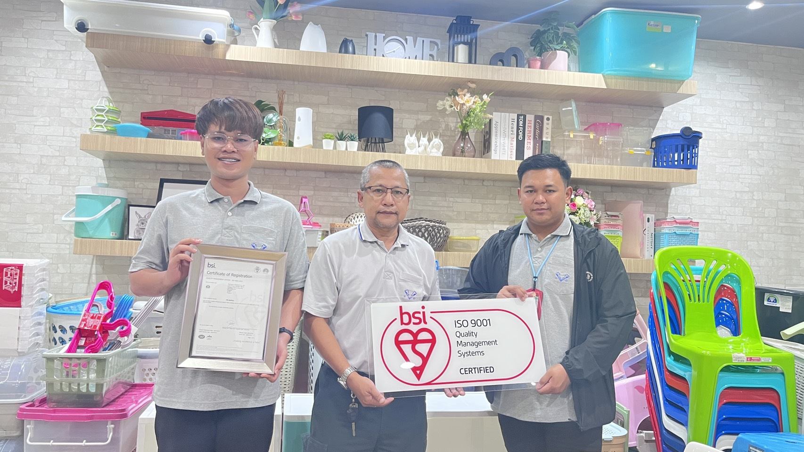
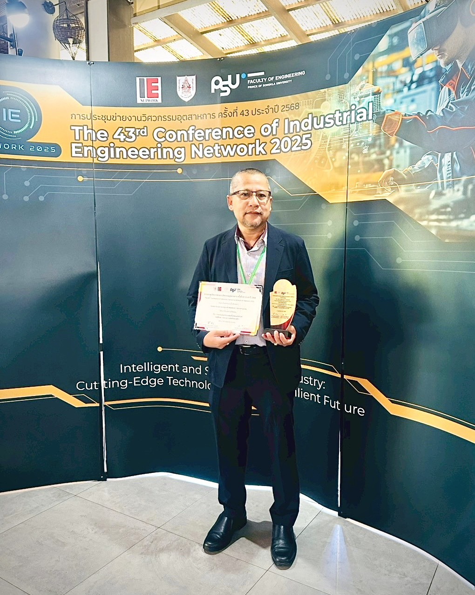

# FutureGreen by Sorawit

**Industrial Sustainability & Digital Factory Consultant**

ISO | ESG | Carbon Footprint | CFO | CFP | Audit Checklist | Factory Dashboard | AI-assisted Consulting Tools

## About

ผมพัฒนาเครื่องมือดิจิทัลและระบบต้นแบบสำหรับโรงงาน SME ไทย เพื่อช่วยให้งาน ISO, ESG, Carbon Footprint, Audit, Dashboard และการปรับปรุงโรงงานใช้งานได้จริง ไม่ใช่เป็นเพียงเอกสารหรือรายงานที่อ่านยาก

I build practical digital tools and consulting prototypes for Thai SME factories, helping ISO, ESG, Carbon Footprint, audit readiness, factory dashboards, and AI-assisted workflows become easier to understand, implement, and sustain.

[FutureGreen Website](https://futuregreennet.com/) | [Digital Tools](https://futuregreennet.com/#digital-tools) | [Knowledge Hub](https://futuregreennet.com/knowledge.html)

## Core Expertise

- ISO 9001 / ISO 14001 consulting and audit readiness
- Carbon Footprint for Organization: CFO
- Carbon Footprint of Product: CFP
- ESG / Sustainability Roadmap
- Audit Checklist Systems
- Factory Dashboard / OEE / Energy / Carbon Monitoring
- AI-assisted consulting workflows

## Featured Projects

| Project | What It Is | Live Demo |
|---|---|---|
| [`futuregreen-consulting`](https://github.com/TheSor55/futuregreen-consulting) | Main FutureGreen website and consulting profile for ISO, ESG, Carbon Footprint, CFO, CFP, and factory sustainability services | [Open website](https://futuregreennet.com/) |
| [`industrial-ai-dashboard`](https://github.com/TheSor55/industrial-ai-dashboard) | Factory dashboard prototype for OEE, downtime, scrap, energy use, and carbon visibility | [View demo](https://thesor55.github.io/industrial-ai-dashboard/) |
| [`gp-audit-checklist`](https://github.com/TheSor55/gp-audit-checklist) | Interactive Green Production audit checklist for self-assessment, internal audits, and real-time scoring | [View demo](https://thesor55.github.io/gp-audit-checklist/) |
| [`esg-carbon-report-assistant`](https://github.com/TheSor55/esg-carbon-report-assistant) | ESG and carbon report assistant for organizing activity data, evidence, and sustainability documentation | [View demo](https://thesor55.github.io/esg-carbon-report-assistant/) |
| [`Carbon-Free-Journey-Calculator`](https://github.com/TheSor55/Carbon-Free-Journey-Calculator) | Simple travel carbon calculator for awareness, low-carbon choices, and carbon reduction communication | [View demo](https://thesor55.github.io/Carbon-Free-Journey-Calculator/) |
| [`aql-sampling-dashboard-`](https://github.com/TheSor55/aql-sampling-dashboard-) | QC / AQL sampling calculator for sample size and Accept / Reject decision support | [View demo](https://thesor55.github.io/aql-sampling-dashboard-/) |

## Practical Experience

Selected examples from ISO, Carbon Footprint, sustainability, training, and research-based factory improvement work.

ตัวอย่างประสบการณ์จากงาน ISO, Carbon Footprint, Sustainability, Training และงานวิจัยที่เกี่ยวข้องกับการปรับปรุงโรงงาน

| Carbon Footprint / Sustainability Project Experience ประสบการณ์งาน Carbon Footprint / Sustainability | ISO / Management System Experience ประสบการณ์งาน ISO / Management System | Research-based Consulting ที่ปรึกษาบนฐานงานวิจัย |
|---|---|---|
|  |  |  |
| Hands-on experience supporting carbon-related initiatives and sustainability implementation in Thai manufacturing context.  ประสบการณ์จากงานจริงในการสนับสนุนโครงการด้านคาร์บอนและความยั่งยืนในบริบทโรงงานไทย | Practical experience supporting ISO system implementation, audit readiness, and management system improvement for manufacturing operations.  ประสบการณ์สนับสนุนการวางระบบ ISO การเตรียมความพร้อมด้าน Audit และการปรับปรุงระบบบริหารจัดการในโรงงาน | Best Paper Award at IE Network 2025 for carbon footprint research in a plastic manufacturing process.  ได้รับรางวัลบทความวิจัยดีเด่นจาก IE Network 2025 ในงานวิจัยด้าน Carbon Footprint ของกระบวนการผลิตพลาสติก |

## Positioning

These repositories are practical prototypes and MVP tools for consulting, training, factory improvement, and digital transformation.

They are designed to help clients see what a useful system could look like before committing to a full implementation. The focus is practical factory use: clearer data, better audit preparation, faster management review, and easier communication between consultants and factory teams.

| Element | Role |
|---|---|
| FutureGreen | Independent consulting brand |
| Website | Main storefront and credibility profile |
| GitHub | Digital tool portfolio |
| Repositories | Working examples of practical factory systems |
| AI / Codex | Development assistant for faster prototyping |
| Sorawit | Consultant, system designer, and project owner |

## How I Use GitHub

This GitHub profile is not only a code portfolio.

It is a working portfolio of tools, templates, and system ideas that support real consulting work for Thai SME factories. Some projects are simple static demos, while others are MVP-level applications prepared for future expansion.

## Project Disclaimer

Some projects are prototypes or MVPs and should be reviewed before production deployment.

They may not include production features such as authentication, database security, role-based access control, backup, monitoring, or formal validation. Any real client implementation should include proper scope definition, data review, security review, and operational controls.

## Contact

- Website: [FutureGreen Consulting](https://futuregreennet.com/)
- Digital Tools: [FutureGreen Digital Tools & Prototype](https://futuregreennet.com/#digital-tools)
- Knowledge Hub: [FutureGreen Knowledge Hub](https://futuregreennet.com/knowledge.html)
- LINE: [Chat on LINE](https://line.me/R/ti/p/@137xvimh)
- Email: [suwansor@gmail.com](mailto:suwansor@gmail.com)
